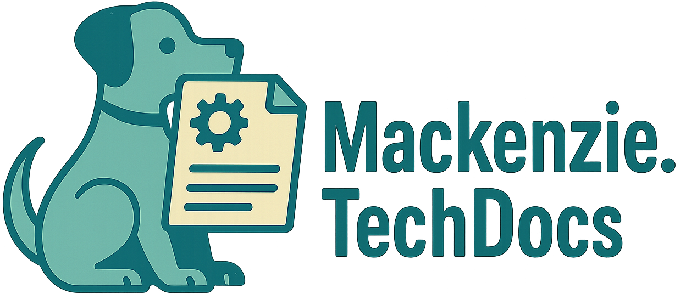

# About Me
My name's Mackenzie! I'm a strategic and detail-oriented Senior Technical Writer with ~7 years of experience crafting clear, accurate, and user-focused documentation across a range of industries—including SaaS, applications, defense, manufacturing, and materials. From API documentation and configuration guides to user manuals and knowledge base content, I translate complex technical concepts into accessible resources that empower users and drive business outcomes.

My work spans the full documentation lifecycle: planning, writing, editing, and publishing, often in close collaboration with cross-functional teams including Product, Engineering, Customer Success, and Sales. I’m experienced with tools like Postman, Swagger, DevOps, Jira, and CMS platforms, and I bring both a collaborative mindset and a results-driven approach to every project.

Outside of work, I’m a passionate meteorology and aviation enthusiast who’s always up for a good hike—or a well-timed storm chase.

Thanks for stopping by!

---

## What I Like to Write
- API Documentation
- Webhook Documentation
- Dev Docs
- Tutorials
- Quick Reference Manuals
- Getting Started Guides
- Case Studies
- White Papers
- Integration Manuals
- Dictionaries and Backend Directories
- Internal Processes
- Policies and Procedures
- Developer Wikis
- And more!

---

# 🛠 Tech Stack

## **Have worked in:**

  
  
  
  
  
  
  
  
  
  
  

## **Version Control Tools**

  
  
  

## **Developer Tools**

  
  
   
  

## **Documentation Tools**

   
  
  
  
  

## **Operating Systems**

  
  
  

## **Collaboration & Project Management**

  
  
  

## **CMS, CRM, and Support Tools**

  
  
  
  
  

---

# Interested?
Check out my [LinkedIn](https://www.linkedin.com/in/mackenzieoc) to learn more about me.

You can also look at my [portfolio](https://www.mackenziesobrien.com) or [GitHub](https://www.github.com/mso-docs) to see what I've been working on.

---
